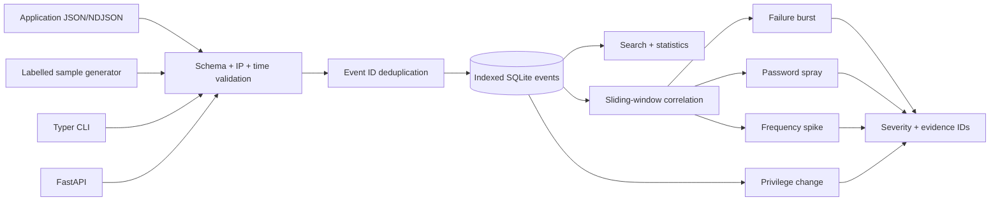

# LogSentry

**Cybersecurity · Data · Observability**

LogSentry is a lightweight defensive log-analysis service that turns normalized application events into explainable security signals. It is **not a complete enterprise SIEM**.

## Problem

Failed logins, privilege changes, new source activity, and sudden request volume often look harmless one event at a time. Small teams may already have evidence of abuse in JSON logs but no affordable correlation layer to expose the pattern.

## Who This Helps

Small security, platform, application, and IT operations teams that control their application logs but do not operate an enterprise SIEM.

## Why It Matters

A password spray can target many accounts slowly enough to evade per-account review. A role change may be rare but high impact. Without normalized, searchable evidence and deterministic rules, investigation begins after damage rather than at the first visible pattern.

## Constraints

LogSentry must run locally, accept a narrow documented schema, avoid paid services, explain every alert with source events, and never claim full SIEM coverage. SQLite targets modest event volume and one instance.

## Solution

Events cross strict normalization, IP/timestamp validation, size bounds, and event-ID deduplication before indexed SQLite storage. Search and statistics use the same normalized records. A deterministic sliding-window engine detects repeated failures, multi-account password spray, abnormal event frequency, and privilege changes, returning rule ID, severity, source, time window, count, summary, and exact event IDs.

## Architecture



## Implemented Features

- Normalized `auth_failure`, `auth_success`, `privilege_change`, and `api_request` events.
- Unique event IDs, timezone-aware timestamps, IPv4/IPv6 validation, bounded actors and metadata.
- Indexed SQLite persistence and duplicate rejection.
- Search by time, event type, source IP, and actor with bounded results.
- Counts by event type, total volume, and unique sources.
- Repeated authentication failure, password-spray, abnormal-frequency, and privilege-change rules.
- `MEDIUM`, `HIGH`, and `CRITICAL` alert severity with complete evidence identifiers.
- REST ingestion, search, statistics, alerts, health, and sample generation.
- CLI NDJSON ingestion, analysis, statistics, and deterministic sample generation.
- Non-root, read-only container deployment with durable storage.

## Technology Stack

Python dataclasses define the normalized schema. SQLite provides local indexes and evidence retention. FastAPI and Typer expose HTTP and operator workflows. The rule engine uses deterministic time-window correlation rather than an opaque model, making alerts testable and explainable.

## Setup and Usage

```bash
python -m venv .venv && . .venv/bin/activate
pip install -e '.[dev]'
logsentry sample sample.ndjson --seed 42 --failures 8
logsentry analyze sample.ndjson
logsentry ingest sample.ndjson --database ./data/logsentry.db
logsentry stats --database ./data/logsentry.db
```

```bash
LOGSENTRY_DB=./data/logsentry.db uvicorn app.api:app --host 127.0.0.1 --port 8003
curl -X POST 'http://127.0.0.1:8003/samples/generate?failures=8&seed=42'
curl http://127.0.0.1:8003/alerts
```

Generated records are marked **SIMULATED SECURITY EVENTS** and are not evidence of a real attack.

## Testing

```bash
pytest -q
python -m compileall -q app tests
```

Tests cover malformed input, invalid IPs, naive timestamps, deduplication, filtering, statistics, window boundaries, failure bursts, password sprays, volume spikes, privilege changes, deterministic samples, and API workflows.

## Security

Logs may contain personal data, internal addresses, and sensitive actions. Producers should omit secrets before transmission. Bind locally or add TLS, authentication, role-based access, rate limits, encrypted storage/backups, retention, and tenant isolation. Sample generation must never share storage with real evidence in production.

## Limitations

- Not an enterprise SIEM, endpoint detector, packet sensor, threat-intelligence platform, or automated incident-response system.
- Rules cover only the documented normalized event types and depend on accurate producer clocks and fields.
- No geo-IP, ownership, or threat attribution is inferred.
- SQLite and the 1,000-event analysis bound target small deployments, not high-volume streaming.
- Alerts are signals requiring investigation; they do not prove malicious intent.

## Contributing

Read [CONTRIBUTING.md](CONTRIBUTING.md). New rules must document assumptions and include positive, negative, boundary, and evidence tests.
