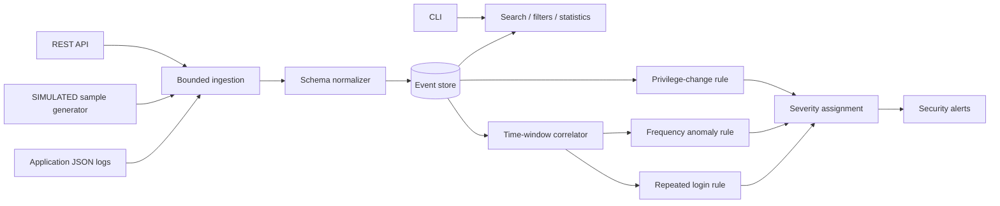

# LogSentry

**Cybersecurity · Data · Observability**

## Problem
Security signals remain buried in application logs because meaningful patterns span multiple events.

## Who This Helps
Small defensive teams without an enterprise SIEM.

## Why It Matters
Repeated failures, suspicious sources, privilege changes, and spikes can remain unnoticed.

## Constraints
The system must be inexpensive, inspectable, testable without paid services, conservative about claims, and safe with untrusted input. SQLite/local execution is the default; production deployments need deliberate persistence, identity, networking, and backup choices.

## Solution
A normalized JSON event store, search API, CLI, statistics, and deterministic rule engine turn event patterns into severity-ranked alerts.

## Architecture

See [architecture](docs/architecture.md).

## Features
The repository implements its domain engine, validation, durable/local state where applicable, executable interfaces, meaningful tests, structured errors, and automation.

## Technology Stack
Python 3.11 provides a portable typed core; FastAPI provides OpenAPI-backed HTTP endpoints; Typer provides operator-friendly commands; SQLite provides a zero-service evidence store. CloudForge instead uses Terraform, Docker, NGINX, and shell-based verification.

## Setup
```bash
python -m venv .venv
. .venv/bin/activate
pip install -e '.[dev]'
```
Copy `.env.example` to `.env` only for local overrides; `.env` is ignored.

## Usage
```bash
python -m app.cli --help
uvicorn app.api:app --host 127.0.0.1 --port 8000
```
CloudForge users should follow `docs/deployment.md`.

## Testing
```bash
pytest -q
```
Tests exercise domain behavior and failure paths without paid infrastructure.

## Security
Inputs are bounded and validated, secrets are accepted through the environment rather than source, errors avoid sensitive internals, and CI runs tests. See [security](docs/security.md) and [threat model](docs/threat-model.md).

## Limitations
LogSentry is a lightweight defensive analysis tool, not a complete enterprise SIEM; detection depends on log quality.

## Contributing
Read [CONTRIBUTING.md](CONTRIBUTING.md), add tests for behavior changes, and avoid real personal or secret data in fixtures.
