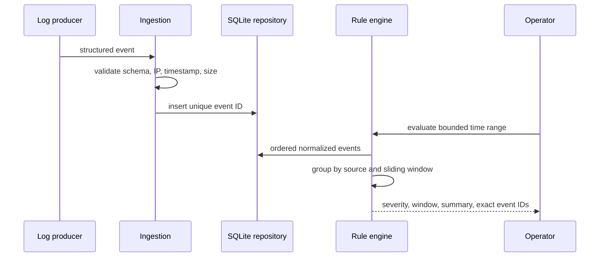

# LogSentry Architecture

LogSentry separates event contracts, persistence, query, and detection. Producers cannot inject arbitrary event names into rule logic: values are converted to a small enum, timestamps require timezone context, IPs are parsed, metadata is bounded, and unique IDs make retries safe.

The repository indexes timestamp, source-plus-time, and type-plus-time. Queries are parameterized and limited to 1,000 events. Rules are pure correlation over normalized events: failure burst counts attempts, password spray counts distinct actors, volume spike counts all source events, and privilege change fires directly on the high-value event.

This is deliberately an explainable small-team architecture. A streaming deployment would replace SQLite/query loading with partitioned storage and windowed processing while retaining the event and alert contracts.
